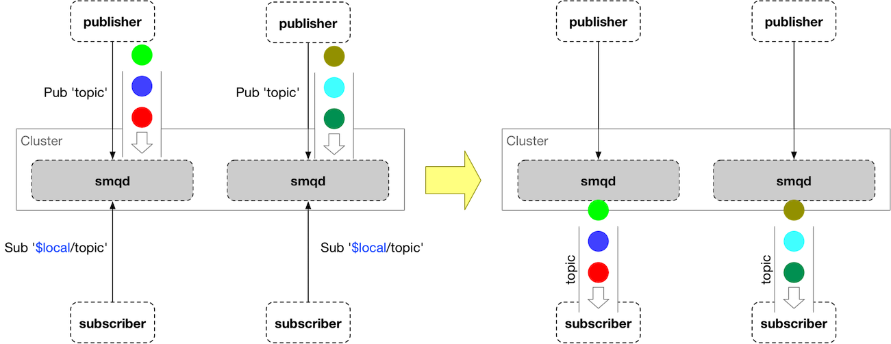
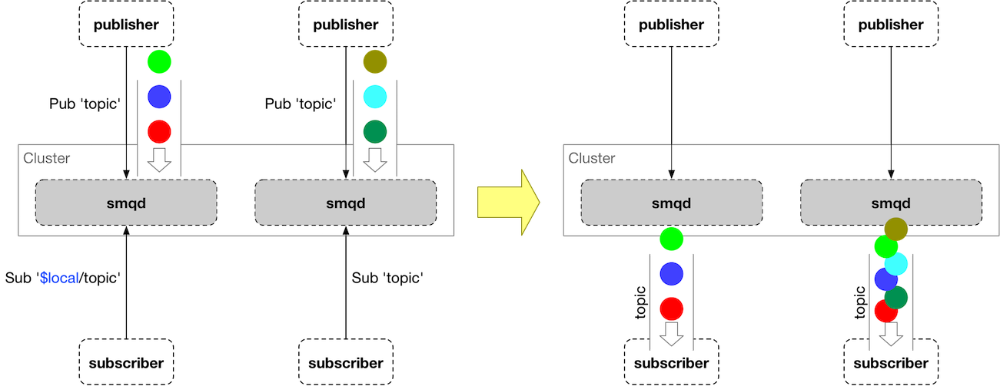
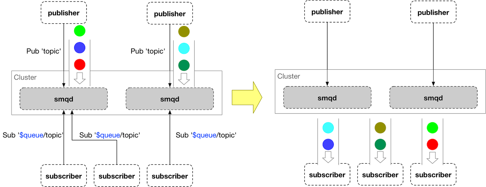
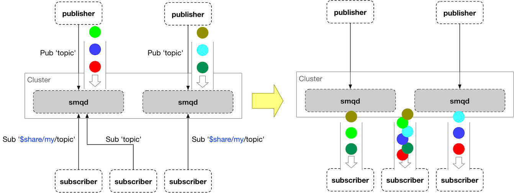
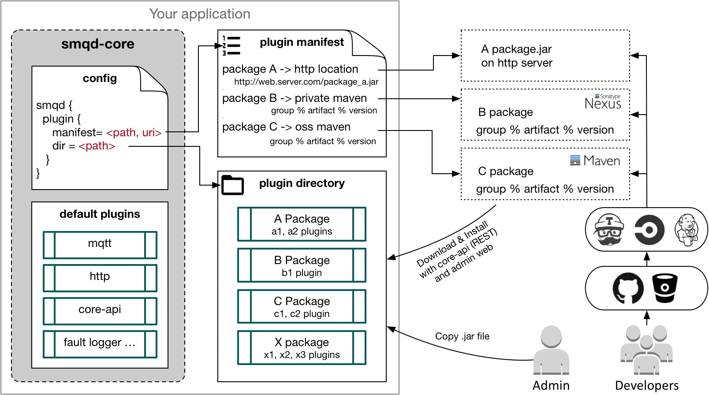

# SMQD core

[](http://www.apache.org/licenses/LICENSE-2.0.html)
[](https://travis-ci.org/smqd/smqd-core)
[](https://oss.sonatype.org/content/groups/public/com/thing2x/smqd-core_2.12/)
[](https://oss.sonatype.org/content/groups/public/com/thing2x/smqd-core_2.12/)

SMQD :: Scala MQtt Daemon

## Usage

```scala
    libraryDependencies += "com.thing2x" %% "smqd-core" % "x.y.z"
```

If you want to try snapshot version, add a resolver for soatype repository.
Since snapshot version can be updated in any time,
it would be better to mark `changing()` on the dependency
so that sbt will check if there is updated snapshot version in the repository

```scala
    resolvers += Resolver.sonatypeRepo("public")

    val smqdVersion = "x.y.z-SNAPSHOT"

    if (smqdVersion.endsWith("-SNAPSHOT"))
        libraryDependencies += "com.thing2x" %% "smqd-core" % smqdVersion changing()
    else
        libraryDependencies += "com.thing2x" %% "smqd-core" % smqdVersion
```

## Features

- [x] Mqtt 3.1.1 (protocol level 0x04)
- [x] Mqtt over TLS (mqtt, mqtts)
- [x] Mqtt over Websockets (ws, wss)
- [x] Clustering (inter-nodes message routing)
- [x] Local Topic
- [x] Queued Topic
- [x] Shared Topic
- [x] System Topic ($SYS)
- [x] Request & Response pattern in embed mode
- [x] Http RESTful API (http, https)
- [x] Bridges (through external plugins)
- [x] Third-party plugins

#### Local Subscription: 

SMQD will not make cluster ranged routes for local subscription, and only deliver the messages on the node

```
    sub '$local/topic'
    pub 'topic'
```



Other normal subscribers are not affected by local subscription.



#### Queue Subscription (Load balancing)

The messages are distributed among *queue* subscribers.


```
    sub '$queue/topic'
    pub 'topic'
```



#### Shared Subscription (Load balancing among the same group subscribers)

The messages are distributed among same *group* subscribers.

```
    sub '$share/<group>/topic'
    pub 'topic'
```



#### System topics

- [x] $SYS/faults : system fault messages
- [x] $SYS/protocols : MQTT network control packet tracking
- [x] $SYS/metric/data : system metric collections
- [x] $SYS/plugins/events : plugin events of changing status


* how to subscribe to smqd via mqtt

```
mosquitto_sub -t sensor/1/# -h 127.0.0.1 -p 1883 -i client_sub -u user -P user -d -V mqttv311
```

* how to publish to smqd via mqtt

```
mosquitto_pub -t sensor/1/temp -h 127.0.0.1 -p 1883 -i client_pub -m "test message" -u user -P user -d -V mqttv311 -q 2
```

#### Mqtt over WebSocket

* how to subscribe to smqd via ws

```
$ npm install mqtt --save
```

```javascript
var mqtt = require('mqtt')
var client  = mqtt.connect('ws://127.0.0.1:8086')

client.on('connect', function () {
  client.subscribe('sensor/+/temperature')
})

client.on('message', function (topic, message) {
  // message is Buffer
  console.log(message.toString())
})
```

* how to publish to smqd via ws

```javascript
var mqtt = require('mqtt')
var client  = mqtt.connect('ws://127.0.0.1:8086')

client.on('connect', function () {
  client.publish('sensor/1/temperature', '10')
  client.publish('sensor/2/temperature', '20')
  client.publish('sensor/3/temperature', '30')
})

```

## Embeded Mode

> SMQD is work-in-progress and may break backward compatibility.


### Initialize

#### Simplest way

```scala
val config = ConfigFactory.load("application.conf")
val smqd = SmqdBuilder(config).build()

smqd.start()

scala.sys.addShutdownHook {
    smqd.stop()
}
```

#### Customized way

```scala
  val config = ConfigFactory.load("application.conf")
  val system = ActorSystem.create("smqd", config)

  val services: Map[String, Config] = ...

  val smqd = SmqdBuilder(config)
    .setActorSystem(system)
    .setUserDelegate(new CustomUserDelegate())
    .setClientDelegate(new CustomClientDelegate())
    .setRegistryDelegate(new CustomRegistryDelegate())
    .setSessionStoreDelegate(new CustomSessionStore())
    .setServices(services)
    .build()

  smqd.start()

  scala.sys.addShutdownHook {
    smqd.stop()
    system.terminate()
  }
```

#### Subscribe API

* actor subscription

```scala
class SubsriberActor extends Actor {
  override def receive: Receive = {
    case (topic: TopicPath, msg: Any) =>
      printlns"====> ${topic} ${msg}")
  }
}

val myActor = system.actorOf(Props(classOf[SubsriberActor]), "myActor")

smqd.subscribe("registry/test/#", myActor)

1 to 100 foreach { i =>
    smqd.publish(s"registry/test/$i/temp", s"Hello")
}

smqd.unsubscribe(myActor)
```

* callback subscription

```scala
val subr = smqd.subscribe("registry/test/+/temp"){
    case (topic, msg) =>
        logger.info(s"====> ${topic} ${msg}")
}

1 to 100 foreach { i =>
    smqd.publish(s"registry/test/$i/temp", s"Hello World - $i")
}

smqd.unsubscribe(subr)
```

#### Publish API

```scala
smqd.publish("my/topic", "Hello Message")
```

#### Request-response API

```scala
implicit val timeout: Timeout = 1 second
implicit val ec: ExecutionContext = system.dispatcher

val f: Future[String] = smqd.request[String]("request/func", classOf[String], "Hello")

f.onComplete {
    case Success(str) =>
        println("Ok Responsed: {}", str)
    case Failure(ex) =>
        println("exception", ex)
}
```

## Cluster

### non-cluster mode

smqd runs non-cluster mode by default. It is configured by akka's provider.
If the provider is set as 'local', other settings of cluster (`smqd.cluster.*`) are ignored

```
akka.actor.provider = local
```

### cluster mode

To start smqd in cluster mode, akka provider should be `cluster`

```
akka.actor.provider = cluster
```

And akka cluster provider requires seed-nodes information for bootstrapping.
smqd supports multiple ways discovering seed-nodes addresses to akka.

#### static

The static discovery method is the default of akka cluster. Please refer the seed-nodes fundamental from
[akka documents](https://doc.akka.io/docs/akka/current/cluster-usage.html#joining-to-seed-nodes).
The only differencie from original akka cluster is using `smqd.static.seeds` instead of `akka.cluster.seed-nodes`.
The other considerations should be same as the akka document says

> Since smqd manages the cluster configuration and bootstrapping procedure by itself,
Do not use `akka.cluster.seed-nodes` in configuration.

```
smqd {
  cluster {
      discovery = static
      static {
        seeds = ["192.168.1.101:2551", "192.168.1.102:2551", "192.168.1.103:2551"]
      }
  }
}
```

#### etcd

You can use etcd as a storage of dynamic seed-node information. In this discovery mode,
you don't need to manage the addresses of nodes in the cluster

```
smqd {
  cluster {
      discovery = etcd
      etcd {
        server = "http://192.168.1.105:2379"
        prefix = /smqd/cluster/seeds
        node_ttl = 1m
      }
  }
}
```

## Customize behaviors

### Delegates

#### Client Authentication

Every application has its own policy to authenticate client's connections. SMQD put this role under `ClientDelegate`.
Application that needs to customize the authentication policy shlould implement `Clientelegate`.
The following code is SMQD's default ClientDelegate implimentation.

There are three parameters for the method `clientLogin()`.
`clientId` represents client-id that is defined in MQTT specification.
And `userName` and `password` are `Option` as MQTT protocol.
If your application doesn't want to allow zero-length clientId or empty `username`,
just return `BaseNameOrpassword` instead of `SmqSuccess`

> The ClientDelegate is called only when a client is connecting to the SMQD via network as a mqtt client.
> Internal publishing/subscription through api is not a subject of the authentication

```scala
class MyAuthDelegate extends com.thing2x.smqd.ClientDelegate {
  override def clientLogin(clientId: String, username: Option[String], password: Option[Array[Byte]]): Future[SmqResult] = {
    Future {
      println(s"[$clientId] username: $username password: $password")
      if (username.isDefined && password.isDefined) {
        if (username.get == new String(password.get, "utf-8"))
          SmqSuccess
        else
          BadUserNameOrPassword(clientId, "Bad user name or password ")
      }
      else {
        SmqSuccess
      }
    }
  }
}
```

There are three ways to register your `ClientDelegate`.

1) Change configuration to replace `ClientDelegate`.

> In this case your customized AuthDelegate class shouldn't have any parameter to instantiate.

```
smqd {
  delegates {
    client = com.sample.MyClientDelegate
  }
}
```

2) `SmqdBuilder` has `setClientDelegate()` that takes an instance of `ClientDelegate`.

> If your `ClientDelegate` needs parameters to instantiate, this is the way to do.

```scala
val smqd = SmqdBuilder(config)
    .setClientDelegate(new MyClientDelegate(...params...))
    .build()
```

3) If you want to get full control of customization delegates, define `FacilityFactory` class and register the factory class in `smqd.conf`.
The default factory is defined as below.

```
smqd.facility_factory = com.thing2x.smqd.impl.DefaultFacilityFactory
```

The `FacilityFactory` is a factory class to produce all kind of delegates implementation.
You can replace it your own factory implementation by extending `DefaultFacilityFactory`.

```scala
class DefaultFacilityFactory(config: Config) extends FacilityFactory {

  override def userDelegate: UserDelegate = {
    new DefaultUserDelegate()
  }

  override def clientDelegate: ClientDelegate = {
    new DefaultClientDelegate()
  }

  override def registryDelegate: RegistryDelegate = {
    new DefaultRegistryDelegate()
  }

  override def sessionStoreDelegate: SessionStoreDelegate = {
    new DefaultSessionStoreDelegate()
  }
}
```

### Plugins

[smqd](https://github.com/smqd/smqd) mqtt broker is also built on smqd-core, it consists of several plugins that provides basic features. It is possible to extend its features by installing additional plugins. Not only the smqd itself but also your application that uses smqd-core as a framework can use the plugin facility, which means that you can build an application logic or business login as a plugin and then install/reinstall/start/stop it by smqd-core REST API or its web UI while the application is running.



When smqd-core is instantiated, it refer to `smqd.plugin.manifest` configuration to find and load the plugin manifest that lists available plugins for the instance. The manifest file can located in local disk of the same machine or remote server. smqd-core supports `http` for remotely located manifest file.

A plugin manifest file contains multiple desciptions of plugin packages. A package can be a plain jar file in a local directory specified by `smqd.plugin.dir` or can be downloaded from remote web server. We recommand to use `maven` repository as a plugin distribution method, since smqd-core supports remote maven repositories to search and download plugins. Using maven repository for plugins has many benefits like downloading dependencies together, easy to integrate with CI tools, guarantee the version of plugin, security and so on.


#### Gateway plugins

- smqd-plugin-coap: CoAP gateway, receiving CoAP messages and translate them to mqtt messages and vice versa.

#### Bridge plugins

- [smqd-bridge-mqtt](http://github.com/smqd/smqd-bridge-mqtt/): bridge between smqd and external mqtt broker
- [smqd-bridge-http](http://github.com/smqd/smqd-bridge-http/): bridge between smqd and external http server

### Configuration

- [Reference config](src/main/resources/smqd-ref.conf)

## For Developers

- Core API

  Postman json file is available [here](src/test/conf/SMQD.postman_collection.json)

  Run smqd-core process with following sbt command to test rest api

```bash
sbt '; set javaOptions ++= Seq("-Dconfig.file=./src/test/conf/smqd-1.conf", "-Dlogback.configurationFile=./src/test/conf/logback.xml", "-Djava.net.preferIPv4Stack=true"); runMain com.thing2x.smqd.Main'
```